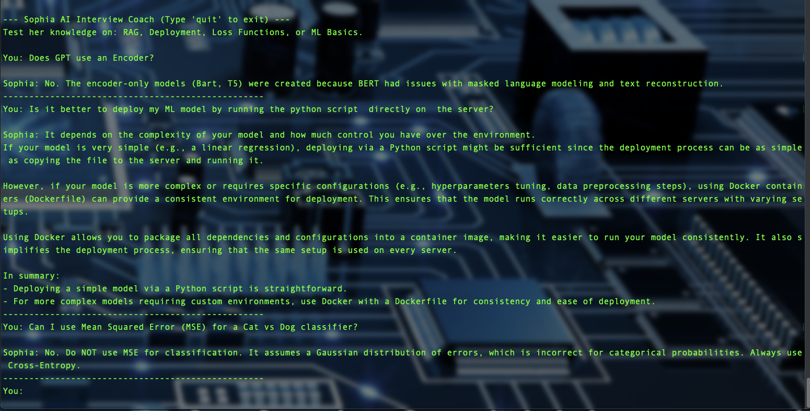
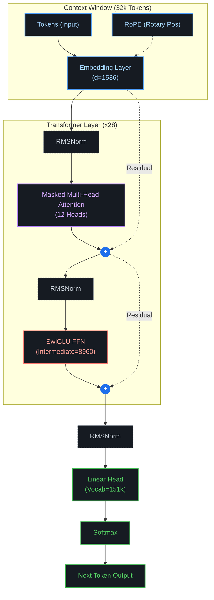
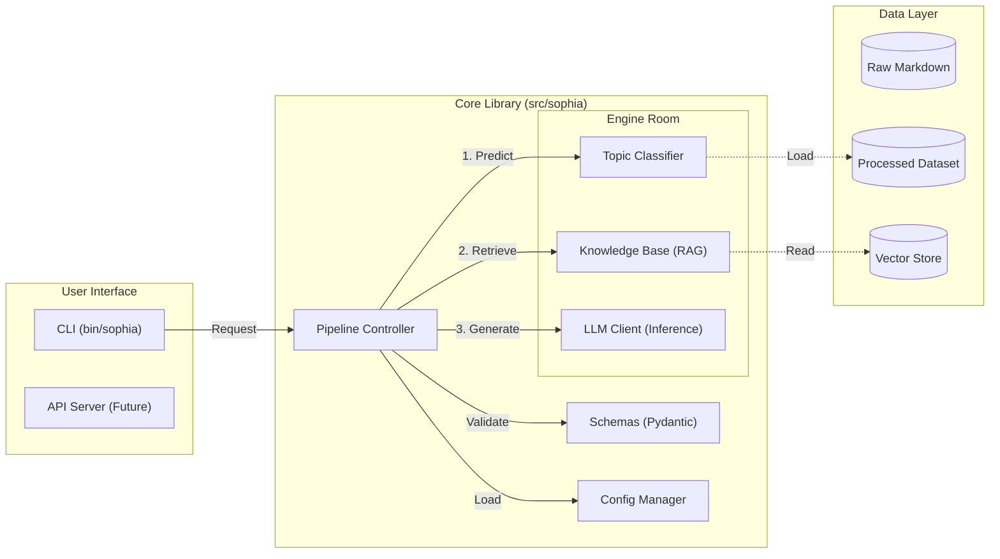

# Sophia AI - Enterprise Interview Coach

**Sophia** is a domain-specific, fine-tuned Large Language Model (LLM) designed to act as an expert technical interviewer for AI/ML, Backend, and MLOps roles.

Unlike generic wrappers, Sophia operates on a **Full Ownership** model. She is not an API call to OpenAI; she is a standalone, 1.5B parameter neural network fine tuned on a proprietary **Enterprise Knowledge Lake**.

---

## 🚀 Key Features

*   **🧠 Custom Fine-Tuned Brain:** Built on a 1.5B parameter foundation, fine-tuned using **QLoRA** on a high-density technical corpus.
*   **🤗 Model Weights:** [Download Sophia-V1 from Hugging Face](https://huggingface.co/jordansegovia/sophia-v1)
*   **📚 Enterprise Knowledge Lake:** A curated ontology of engineering wisdom (`ai-ml-backend-datasets`), structured into domains like MLOps, Deep Learning, and System Design.
*   **🛠️ Synthetic Alignment:** Uses **Targeted Data Augmentation** to correct common base-model hallucinations (e.g., enforcing "GPT is Decoder-Only", "No MSE for Classification").
*   **⚡ Local Inference:** Runs 100% locally on Apple Silicon (MPS/Metal) or CUDA. No data leaves your machine.

---

## 🏗️ Architecture

### Model Architecture (Transformer)


The system follows a modern **Instruction Tuning** pipeline:

1.  **Ingestion:** Raw Markdown notes are ingested from `ai-ml-backend-datasets`.
2.  **Feature Engineering:**
    *   Data is deduplicated (SHA256 hashing).
    *   Filtered for quality and language.
    *   Augmented with synthetic "Hard Negatives" to fix reasoning gaps.
3.  **Training:**
    *   **Base:** Qwen 2.5 (1.5B).
    *   **Adapter:** LoRA (Rank 16, Alpha 32).
    *   **Merge:** Weights are fused into a standalone artifact (`models/sophia-v1-standalone`).

---

## 📂 Project Structure

### System Map


```text
sophia-ai/
├── ai-ml-backend-datasets/      # (External) The Source of Truth
│   ├── raw/domain_knowledge/    # The "Gold" Corpus (Markdown)
│   └── processed/               # The "Fuel" (Tokenized Arrow Files)
│
├── models/
│   ├── sophia-v1-standalone/    # The Fused, Production-Ready Model
│   └── README.md                # Model Card (Hyperparameters)
│
├── scripts/
│   ├── prepare_data.py          # ETL Pipeline (Clean -> Hash -> Split)
│   ├── finetune_llm.py          # Training Loop (Hugging Face Trainer)
│   ├── augment_data.py          # Synthetic Data Generator
│   └── audit_data_quality.py    # Forensic Data Unit Tests
│
├── src/
│   └── sophia/
│       └── llm_client.py        # Inference Engine
```

---

## 🛠️ Quick Start

### 1. Setup Environment
```bash
python -m venv venv
source venv/bin/activate
pip install -r requirements.txt
```

### 2. Train the Model (Optional)
If you want to reproduce the weights from the raw knowledge base:
```bash
# 1. Build the Dataset
python scripts/prepare_data.py

# 2. Run Fine-Tuning
python scripts/finetune_llm.py
```

### 3. Chat with Sophia
Launch the interactive shell to interview the model.
```bash
PYTHONPATH=src python scripts/chat.py
```

---

## 📊 Performance & Governance

*   **Hallucination Rate:** Minimally observed on core topics due to "Sledgehammer" augmentation.
*   **Data Lineage:** All training data is versioned in `ai-ml-backend-datasets`.
*   **PII Safety:** Automated audit scripts run prior to every training job.

---

**Author:** DJ Jordan
**License:** Apache 2.0